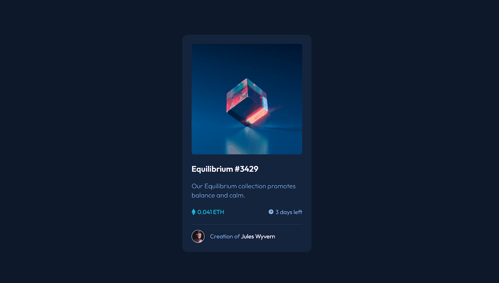

# Frontend Mentor - NFT preview card component solution

Esta é uma solução para o [NFT preview card component challenge on Frontend Mentor](https://www.frontendmentor.io/challenges/nft-preview-card-component-SbdUL_w0U). 
## Table of contents

- [Overview](#overview)
  - [O Desafio](#O-Desafio)
  - [Screenshot](#screenshot)
  - [Links](#links)
- [My process](#my-process)
  - [Construído com](#Construído-Com)
  - [O que Aprendi](#what-i-learned)
  - [Continued development](#continued-development)
  - [Useful resources](#useful-resources)
- [Author](#author)

## Overview

## Overview

### O Desafio

Os usuários devem ser capazes de:

Ver e explorar um Cartão de pré-visualização de NFT, com efeitos ao passar o mouse por cima de alguns elementos. 

### Screenshot

### Links

- Solution URL: [Add solution URL here](https://your-solution-url.com)

## Meu Processo

### Construído com

- Semantic HTML5 markup
- CSS custom properties
- Flexbox
- Pseudo Classes

### O que Aprendi

Neste projeto utilizamos display flex para organizar o layout, tag de titulos, paragrafos span entre outros; 
Na parte de CSS utilizamos efeitos com as pseudos classes para poder alcançar o modo active do designer;
Utilizamos também variáveis para organizar as fontes e cores utilizadas na página.

### Desenvolvimento Contínuo

Desejo continuar melhorar na questão de espaçamentos do CSS, melhorar e estudar mais sobre display flex, aprofundar no assunto de pseudo classes e efeitos, pois tive dificuldades na execução.
Continuar e melhorar na questão de responsividade, deixando os projetos com maior compatibilidade em diversos instrumentos de acesso.

#### Useful resources

None

## Author

- Website - [Andre Dantas](https://github.com/andredantasti)
- Frontend Mentor - [@andredantasti](https://www.frontendmentor.io/profile/andredantasti)
- Instagram - [@andredantasti](https://www.instagram.com/andredantasti)